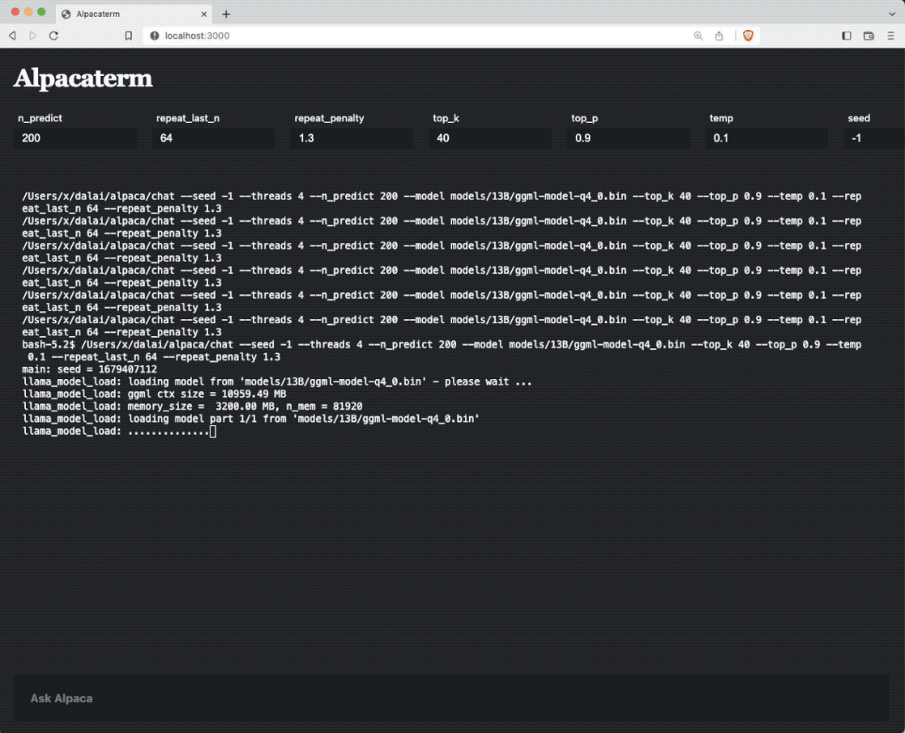

# Alpacaterm

> Talk to Alpaca on terminal

Powered by [alpaca.cpp](https://github.com/candywrap/alpaca.cpp) and [Dalai](https://github.com/cocktailpeanut/dalai)

# What it looks like

# Get started

1. Clone this repository: `git clone https://github.com/alpacaterm/alpacaterm.git`
2. Run `npm install` to install dependencies
2. Run `npm run 7b` to download 7b model
3. Run `npm start` to run the web UI

